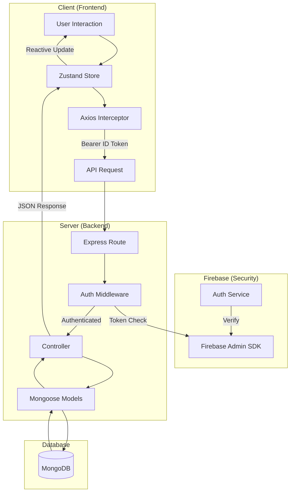

# TaskFlow - Full-Stack Todo Application

TaskFlow is a robust, full-stack Todo application designed for organizing tasks into categorized boards. It features a modern React frontend and a secure Node.js backend, leveraging Firebase for authentication and MongoDB for persistent storage.

## 🚀 Getting Started

Follow these steps to get the project running locally on your machine.

### Prerequisites

- [Node.js](https://nodejs.org/) (v16+ recommended)
- [MongoDB](https://www.mongodb.com/) (Local instance or Atlas URI)
- [Firebase account](https://firebase.google.com/) for authentication setup

### 🏗️ Architecture Overview

The system follows a refined client-server pattern with centralized state management and token-based identity verification.

#### 🔄 Diagrammatic Workflow



#### Detailed System Flow:
1.  **Identity Initiation**: User logs in/signs up via the frontend using **Firebase Client SDK**. Firebase issues a temporary **ID Token**.
2.  **Request Decoration**: Every request sent from the frontend is captured by an **Axios Interceptor** which attaches the ID Token to the `Authorization` header.
3.  **Authentication Gate**: The **Backend Middleware** catches the request, extracts the token, and verifies it with **Firebase Admin**.
4.  **Business Logic**: Once verified, the **Controller** processes the request and interacts with **MongoDB** via Mongoose models.
5.  **State Sync**: The response is captured by the **Zustand Store**, which updates the global state and triggers a reactive UI update.

#### System Workflow
1.  **Authentication**: Handled by Firebase. The frontend obtains a Firebase ID Token upon login.
2.  **API Requests**: Frontend sends the ID Token in the `Authorization: Bearer <token>` header via Axios interceptors.
3.  **Backend Verification**: Express middleware (`authMiddleware`) uses `firebase-admin` to verify the token and identify the user.
4.  **Database**: Mongoose manages User, Board, and Todo models in MongoDB.

#### Frontend Stack
- **Framework**: React 19 (Vite)
- **State Management**: Zustand (for reactive UI updates)
- **Styling**: Tailwind CSS & Lucide React
- **Authentication**: Firebase Client SDK
- **Networking**: Axios with request interceptors

#### Backend Stack
- **Runtime**: Node.js (ES Modules)
- **Framework**: Express.js
- **Database**: MongoDB & Mongoose
- **Auth**: Firebase Admin SDK

---

### 📦 Installation

1.  **Clone the repository**:
    ```bash
    git clone <repository-url>
    cd todoappAssessment
    ```

2.  **Backend Setup**:
    ```bash
    cd backend
    npm install
    ```
    - Create a `.env` file in the `backend/` directory:
      ```env
      PORT=3000
      MONGODB_URI=your_mongodb_connection_string
      ```
    - Place your Firebase Service Account key in `backend/src/config/serviceAccountKey.json`.

3.  **Frontend Setup**:
    ```bash
    cd ../frontend
    npm install
    ```
    - Create a `.env` file in the `frontend/` directory:
      ```env
      VITE_FIREBASE_API_KEY=xxx
      VITE_FIREBASE_AUTH_DOMAIN=xxx
      VITE_FIREBASE_PROJECT_ID=xxx
      VITE_FIREBASE_STORAGE_BUCKET=xxx
      VITE_FIREBASE_MESSAGING_SENDER_ID=xxx
      VITE_FIREBASE_APP_ID=xxx
      ```

---

### 🛠️ Running the Application

To run both servers concurrently:

1.  **Start Backend**:
    ```bash
    cd backend
    npm run dev
    ```
    The server will start on `http://localhost:3000`.

2.  **Start Frontend**:
    ```bash
    cd frontend
    npm run dev
    ```
    The app will be available at `http://localhost:5173`.

---

### 📂 Directory Structure

```text
├── backend/
│   ├── src/
│   │   ├── config/       # Firebase admin & DB config
│   │   ├── controllers/  # Route handlers
│   │   ├── models/       # Mongoose schemas
│   │   ├── routes/       # API endpoints
│   │   ├── middlewares/  # Auth & error handling
│   │   └── utils/        # ApiError, ApiResponse helpers
│   └── .env
├── frontend/
│   ├── src/
│   │   ├── api/          # Axios config & interceptors
│   │   ├── components/   # UI components
│   │   ├── context/      # Authentication state
│   │   ├── firebase/     # Client configuration
│   │   └── store/        # Zustand state management
│   └── .env
└── README.md
```

## 🛡️ Key Features
- **Secure Auth**: Firebase integration for login and signup.
- **Persistent Boards**: Create and manage multiple task boards.
- **Modular Design**: Separation of concerns between controllers, routes, and services.
- **Optimistic Updates**: Snappy UI using Zustand for immediate state changes.